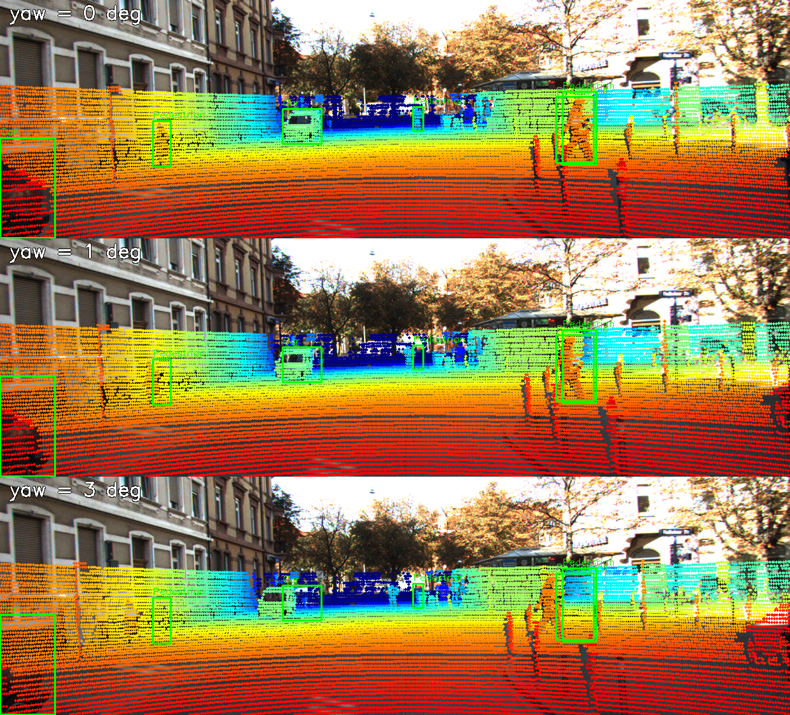
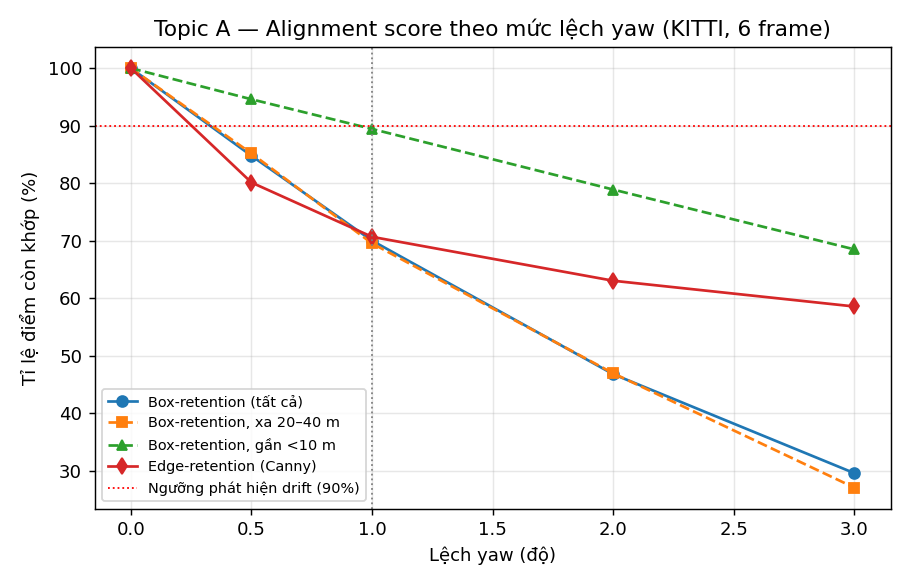
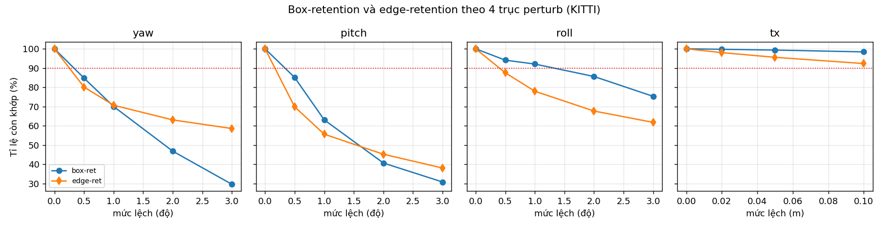
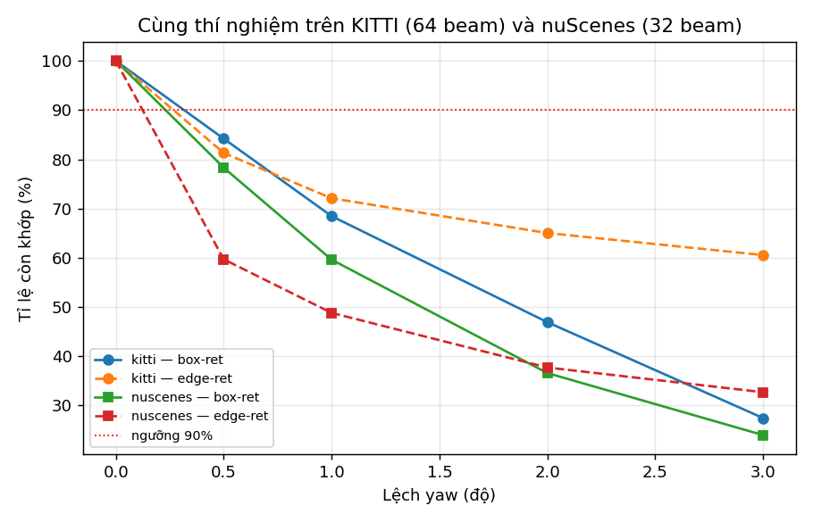
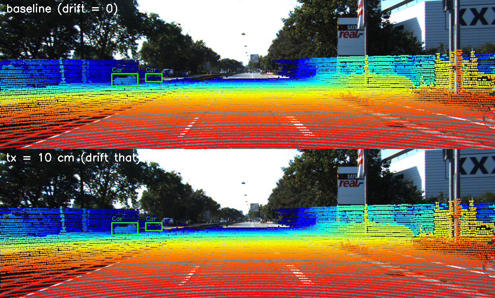

# Báo cáo Day 6: Kiểm định calibration LiDAR-camera bằng projection và đo độ nhạy với drift

- **Họ tên:** Nguyen Phuc Huy
- **MSSV:** 2A202602911
- **Lớp:** K4 - Track 4 (AI20K)
- **Link repo:** https://github.com/Yuhnguyn/NguyenPhucHuy-2A202602911-Track4-Day21
- **Topic:** A — LiDAR-camera projection QA
- **Dataset:** data/synthetic, data/kitti_mini, data/nuscenes_mini_subset
- **Các frame đã dùng:** synthetic 000000–000004; kitti_mini 000011, 000016, 000019, 000004, 000009, 000061, 000031; nuscenes_mini_subset scene-0103_010, scene-0103_000, scene-1094_020

> Hãy viết ngắn: mỗi mục từ 3 đến 8 dòng, ưu tiên số liệu và hình ảnh.

## 1. Claim

**Claim:** Lệch calibration **yaw 1°** làm tỉ lệ điểm LiDAR còn rơi đúng vào 2D box của vật ở khoảng cách 20–40 m giảm từ 100% xuống ~70% (**−30 điểm phần trăm**), mạnh gấp ~3 lần so với vật gần <10 m (−11 điểm phần trăm); ngưỡng phát hiện drift 90% phát hiện được yaw từ 0.5°. **Nhưng** drift **tịnh tiến ngang 10 cm** (tương đương ~0.2° ở 30 m) **không bị phát hiện**: box-retention vẫn ≥ 98% và edge-retention 92%, tức metric bỏ sót lỗi dịch chuyển thuần túy.

## 2. Evidence

Hai metric alignment được đo trên 6 frame KITTI (000004, 000011, 000016, 000019, 000031, 000061), mỗi frame chạy đủ 4 mức yaw. Số liệu ở `results/yaw_perturb_sweep.csv`, `pitch_perturb_sweep.csv`, `roll_perturb_sweep.csv`, `tx_perturb_sweep.csv`, `dataset_compare.csv`, `latency.csv`.

| Mức lệch yaw | %điểm vào box | box-ret 20–40 m | box-ret <10 m | edge-ret (Canny) |
|---|---|---|---|---|
| 0° (baseline) | 100.0% | 100.0% | 100.0% | 100.0% |
| 0.5° | 92.7% | 85.2% | 94.6% | 80.1% |
| **1.0°** | **85.9%** | **69.5%** | **89.4%** | **70.7%** |
| 2.0° | 73.5% | 47.0% | 78.9% | 63.0% |
| 3.0° | 60.4% | 27.1% | 68.5% | 58.6% |

Nhận xét: metric giảm đơn điệu theo mức lệch; **edge-retention nhạy hơn** ở mức nhỏ (0.5°: 80% vs 85%) nhưng **bão hòa sớm** ở mức lớn (3°: 58.6% so với box-ret 29.6%) vì nhiều điểm rời khỏi cạnh nhưng vẫn trong box. Chạy lại cho ra đúng cùng số liệu (seed cố định, không có ngẫu nhiên).

Latency projection (KITTI 000011, 108 004 điểm, Intel Core i5-8210Y, CPU-only, bỏ lần chạy đầu, 39 lần): **p50 = 26.1 ms, p95 = 34.6 ms** (`results/latency.csv`).






So sánh 2 dataset (`results/dataset_compare.csv`): cùng yaw 1°, KITTI giảm box-ret còn 68.5% còn nuScenes còn 59.6%; edge-ret KITTI 72.1% vs nuScenes 48.8%. nuScenes nhạy hơn vì tia thưa (32 beam vs 64) và ảnh 1600×900 khiến mỗi điểm ít trùng cạnh hơn.

## 3. Failure case

**Failure 1 — drift tịnh tiến không bị phát hiện (lớp Metric + Geometry).** Với `tx = 10 cm`, box-retention tổng chỉ còn 98.4% và edge-retention 92.3% (`results/tx_perturb_sweep.csv`) — cả hai đều **trên ngưỡng 90%**, nên hệ thống **không báo drift** dù calibration thực đã lệch. Xét từng object (frame 000004, `src/per_object_retention.py`): Car 38.3 m giữ 99.3%, Car 51.2 m giữ 97.4%. Nguyên nhân: dịch ngang t gây dịch pixel Δu = f·t/z; với f ≈ 721 px, t = 0.1 m thì ở 30 m chỉ lệch ~2.4 px, nhỏ hơn nhiều so với bề rộng box → điểm vẫn nằm trong box. Lỗi này thuộc lớp **Metric** (cách đo không phản ánh kiểu lỗi tịnh tiến) và **Geometry** (ảnh hưởng của tịnh tiến khác xoay, không được mô hình hóa riêng).

**Failure 2 — vật lớn ở gần che giấu lỗi xoay (lớp Metric).** Truck ở 5.5 m (frame 000019) vẫn giữ box-retention 96.4% khi yaw lệch 1° và 88.4% khi lệch 3°, trong khi một Car nhỏ ở 59.6 m rơi xuống 33.3% (1°) và 0% (3°). Vì box của vật lớn ở gần rất rộng, điểm vẫn rơi vào box nên vật đó **không đóng góp tín hiệu cảnh báo**.

Cách phát hiện trên xe thật: đo drift **theo từng object và từng dải khoảng cách**, và thêm metric nhạy tịnh tiến (so khớp **cạnh độ sâu LiDAR với cạnh ảnh**, đo **độ dịch tâm khối** theo phương ngang giữa hai bản đồ cạnh) thay vì chỉ đếm điểm-trong-box; ghi log phần dư này theo thời gian và cảnh báo khi vượt ngưỡng.



## 4. Khuyến nghị nếu triển khai thật

Use-case: **ADAS/robot tự hành** dùng LiDAR-camera fusion. Projection đúng là điều kiện tiên quyết để gán nhãn, fusion 3D-2D và kiểm tra chéo cảm biến. Trên xe, sensor bracket có thể lệch sau va chạm hoặc do nhiệt/dao động.

Trade-off: metric điểm-trong-box rẻ (chạy chung với projection, ~26 ms/frame CPU) nhưng **mù với drift tịnh tiến** và bị vật lớn che; metric cạnh nhạy hơn nhưng phụ thuộc texture ảnh (yếu ban đêm/mưa — như nuScenes scene-1094). Đề xuất: **chạy online mỗi frame** (chi phí thấp), kết hợp nhiều metric, và **hiệu chỉnh lại định kỳ**.

Chỉ số cần ghi log khi chạy thật: box-retention và edge-retention theo dải khoảng cách; độ dịch ngang tâm khối LiDAR-vs-ảnh; phần dư calibration (yaw/pitch/roll/t) ước lượng; tỉ lệ điểm vào FOV; và cảnh báo khi metric vượt ngưỡng liên tiếp nhiều frame.

## 5. Cách chạy lại

```bash
# 0) Môi trường (đã có sẵn numpy/opencv/matplotlib/pandas)
pip install -r requirements.txt

# 1) Kiểm tra dữ liệu + thống kê sức khoẻ
python tools/verify_data.py --data-root data/kitti_mini
python tools/verify_data.py --data-root data/nuscenes_mini_subset
python -m starter.data_health --data-root data/synthetic --out results/data_health_synthetic.csv

# 2) Demo projection (2 hàm TODO(CP2) trong starter/projection.py)
python -m starter.projection --data-root data/synthetic --frame 000000
python -m starter.projection --data-root data/kitti_mini --frame 000011
python -m starter.projection --data-root data/nuscenes_mini_subset --frame scene-0103_010

# 3) Thí nghiệm chính (sinh CSV)
python src/projection_qa.py sweep --data-root data/kitti_mini \
  --frames 000011 000004 000019 000031 000016 000061 --axis yaw --values 0 0.5 1 2 3 \
  --csv results/yaw_perturb_sweep.csv
python src/projection_qa.py sweep --data-root data/kitti_mini \
  --frames 000011 000004 000019 000031 000016 000061 --axis pitch --values 0 0.5 1 2 3 \
  --csv results/pitch_perturb_sweep.csv
python src/projection_qa.py sweep --data-root data/kitti_mini \
  --frames 000011 000004 000019 000031 000016 000061 --axis roll --values 0 0.5 1 2 3 \
  --csv results/roll_perturb_sweep.csv
python src/projection_qa.py sweep --data-root data/kitti_mini \
  --frames 000011 000004 000019 000031 000016 000061 --axis tx --values 0 0.02 0.05 0.1 \
  --csv results/tx_perturb_sweep.csv
python src/projection_qa.py compare-datasets --axis yaw --values 0 0.5 1 2 3 --csv results/dataset_compare.csv
python src/projection_qa.py latency --data-root data/kitti_mini --frame 000011 -n 40 --csv results/latency.csv
python src/projection_qa.py audit --data-root data/synthetic --csv results/synthetic_audit.csv

# 4) Biểu đồ + ảnh demo/failure
python src/make_figures.py

# 5) Kiểm tra trước khi nộp
python tools/check_submission.py
```

## 6. Khai báo sử dụng AI

| Công cụ | Dùng cho việc gì | Bạn đã kiểm chứng thế nào |
|---|---|---|
| Trợ lý AI lập trình (OpenCode) | Gợi ý cài đặt 2 hàm TODO (`velo_to_cam`, `cam_to_image`), viết tool `src/projection_qa.py`/`src/make_figures.py`, rà lại logic biến đổi hệ toạ độ và cách tính metric | Kiểm chứng bằng test thủ công ở CP2: điểm velodyne `(10, 0, 0)` cho `z_cam = 9.727` (≈9.73) và pixel `(614, 175)` như đề bài yêu cầu; chạy lại sweep 2 lần ra cùng số liệu; đối chiếu overlay bằng mắt (điểm khớp lên xe/người/cột/mặt đường, không có điểm trên bầu trời) |

Toàn bộ code và số liệu nộp đều được tạo bằng cách chạy thật trong repo này; không có số liệu hay ảnh nào do AI bịa.
